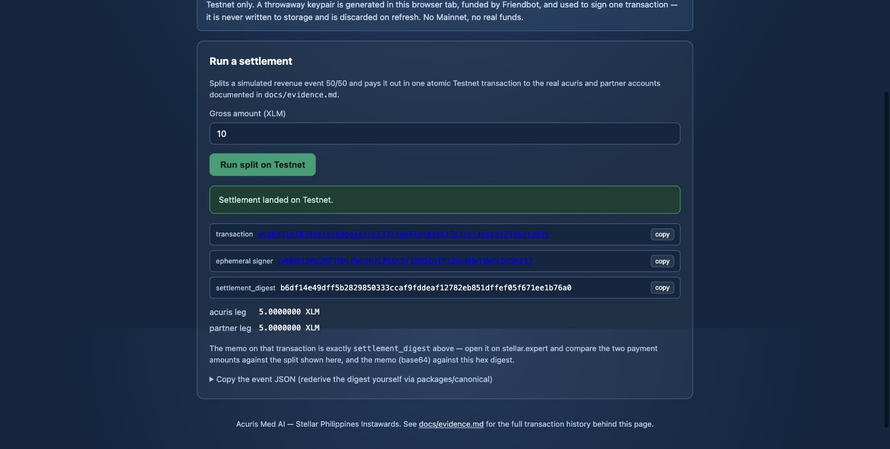
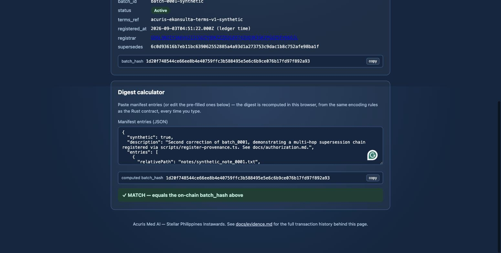
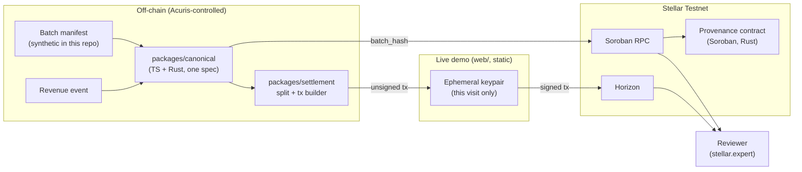

<!-- markdownlint-disable MD033 -->
<div align="center">

# Acuris Stellar PoC

### Verifiable rails for a Philippine clinical-documentation platform

**Built on Stellar Testnet. Proven, not promised.**

Two flows for Acuris Med AI's Stellar Philippines Instawards project: a revenue-share
settlement rail, and a tamper-evident provenance registry for de-identified clinical data.


[**Live demo**](https://testnet.acurismed.com/) · [Acuris Med AI](https://acurismed.com) · [Live contract](https://stellar.expert/explorer/testnet/contract/CCTYK4O5YMMCA2JYXVZRHDGKTJBBX56ALHRR3BBW32K4Y7RPCWBYFJ77) · [Evidence](docs/evidence.md) · [Architecture](docs/architecture.md) · [Runbook](docs/runbook.md) · [Roadmap](docs/roadmap.md)

</div>

> [!IMPORTANT]
> **Testnet only.** No Mainnet, no real XLM, no live partner funds, no PHI/PII on-chain or
> anywhere in this repository. The live demo signs with a throwaway keypair generated in your
> own browser tab — nothing to install, nothing to trust with a real key. See
> [Scope boundaries](#-scope-boundaries).

---

## 🖥️ The demo

Both tabs are live against the real deployed contract and real funded Testnet accounts —
**[open it](https://testnet.acurismed.com/)** and click through yourself, or
look at what it produced:

<table>
<tr>
<td width="50%" valign="top">
<strong>Settlement rail</strong> — split &amp; pay, atomically
<br><br>

</td>
<td width="50%" valign="top">
<strong>Provenance</strong> — verify on-chain, and again in your browser
<br><br>

</td>
</tr>
</table>

## 🧩 Why this exists

[Acuris Med AI](https://acurismed.com) runs a clinical documentation platform for the Philippine
healthcare and medical transcription market, and has a signed Memorandum of Agreement with
E-Konsulta Medical Clinic (2026-06-24) structured as a 50% revenue-share on laboratory and
prescription routing. Two things are unbuilt for the pilot: a settlement mechanism (today, manual
bank transfers — slow, costly to reconcile, no independently verifiable record), and a provenance
record for the de-identified clinical dataset Acuris uses for ASR/LLM work (today, no
tamper-evident record of what that data is or the terms it may be used under). The team had no
prior Stellar or Soroban experience before this project.

## 🔁 What it does

| Capability | What it proves | Status |
|---|---|---|
| **Split** | A revenue event splits 50/50 in integer minor units — no floats, a `sum(legs) === gross` property test over 10,000 random draws | Done — `packages/settlement` |
| **Settle** | Both payment legs land in one atomic classic Stellar transaction, memo-tagged with a digest of the event that authorized it | **Live on Testnet** — [demo](https://testnet.acurismed.com/#settlement), [evidence](docs/evidence.md) |
| **Hash** | A batch manifest's digest is computed identically in TypeScript and Rust from one written spec, cross-checked against fixed vectors | Done — `packages/canonical`, `contracts/provenance` |
| **Register** | A digest, an opaque batch id, and a terms reference are recorded on-chain — fail-closed on duplicates, non-destructive on corrections | **Deployed & live** — [contract](https://stellar.expert/explorer/testnet/contract/CCTYK4O5YMMCA2JYXVZRHDGKTJBBX56ALHRR3BBW32K4Y7RPCWBYFJ77) |
| **Verify** | Anyone — reviewer or Acuris — can independently recompute a digest and check it against the chain, with no special access | **Live** — [demo](https://testnet.acurismed.com/#provenance) |

## 🌐 How it uses Stellar

| Stellar capability | How this project uses it |
|---|---|
| **Classic transactions** | One transaction, two payment operations, atomic by construction — either both settlement legs land or neither does. The 50/50 ratio is computed off-chain, not enforced by on-chain code (see [Deferred: on-chain-enforced split](docs/architecture.md#deferred-on-chain-enforced-split)). |
| **`MEMO_HASH`** | Every settlement transaction carries the SHA-256 digest of the off-chain revenue event it settles — a reviewer can recompute that digest independently and compare it to the memo on the ledger. |
| **Soroban storage + `require_auth`** | The provenance contract is a minimal append-only registry: an admin/registrar allow-list enforced by `require_auth()`, fail-closed duplicate rejection, and non-destructive supersession for corrections. |
| **Soroban RPC (read)** | The live demo's Provenance tab queries the deployed contract by simulation only — no signing, no submission, just a read. |
| **Horizon + Friendbot** | The live demo's Settlement tab generates a keypair in your browser, funds it via Friendbot, and submits the signed transaction directly to Horizon. |

## 🔒 What never touches the chain

> **Nothing that identifies a patient, a clinical event, or clinical content ever leaves
> Acuris's existing infrastructure.** — [`docs/privacy-model.md`](docs/privacy-model.md)

On-chain, ever: a one-way digest, a handful of opaque business identifiers, a ledger timestamp.
Never on-chain: the clinical files themselves, per-file hashes, the assembled manifest, or the
revenue event's business details (those stay in `fixtures/`, off-chain). Every synthetic fixture
in this repo is labeled `"synthetic": true`, and the registration script refuses to run against
one that isn't.

That honesty runs the other way too — see
[**"What the chain does *not* prove"**](docs/privacy-model.md#what-the-chain-does-not-prove):
a public ledger entry confirms that an authorized party recorded specific bytes at a specific
time. It does not confirm the off-chain de-identification was adequate, or that a terms document
says what Acuris claims. Naming that limit here, plainly, is deliberate.

## 🧭 How it fits together



Full sequence diagrams for both flows, the trust-boundary table, and the funded-sprint variant
(Stellar Wallets Kit signing, the testanchor asset) are in
[`docs/architecture.md`](docs/architecture.md).

## 🔗 Live Testnet contract

| Contract | Address | Explorer |
|---|---|---|
| Provenance registry | `CCTYK4O5YMMCA2JYXVZRHDGKTJBBX56ALHRR3BBW32K4Y7RPCWBYFJ77` | [View on Stellar Expert](https://stellar.expert/explorer/testnet/contract/CCTYK4O5YMMCA2JYXVZRHDGKTJBBX56ALHRR3BBW32K4Y7RPCWBYFJ77) |

WASM hash `5d5096d703b69a1fb63740ca75b5fe8e301ba3488839967268b55b503f336f3e` (8,047 bytes
optimized). Exported functions: `get`, `get_by_batch_id`, `init`, `register`, `revoke`,
`set_registrar`. This is a Testnet deployment and may be replaced if SDF resets the network — see
[`docs/runbook.md`](docs/runbook.md)'s "Known operational risk" if the contract ID above stops
resolving.

## 🧾 Evidence

`docs/evidence.md` is the full manifest: every field on the contract table above, all 8 D2
transaction hashes (including a two-hop correction chain demonstrating non-destructive
supersession), both fail-closed negative cases (`DuplicateRecord`, `NotAuthorizedRegistrar`,
confirmed live), and D1's own first real settlement — cross-checked against raw Horizon queries,
not just CLI or page output. A one-line taste of what's in there:

| # | What | Tx hash |
|---|---|---|
| 5–8 | D2: a fresh registration, an unrelated batch, and a 2-hop `supersedes` correction chain | [`0fc74068…`](https://stellar.expert/explorer/testnet/tx/0fc740680925fffbf98d6d0da20b6d9ae153cd207044c60154a805ad8143e7c1) → [`248ad77c…`](https://stellar.expert/explorer/testnet/tx/248ad77c0bdaa90b4bcf69e6cbd4e7111212edc34554eb210e174ce82cfc9e30) → [`bfdbc888…`](https://stellar.expert/explorer/testnet/tx/bfdbc8883f5d25b516cba73296d81688e37895698703b4e0e47e7ca0585f6f42) |
| — | D1: the live demo's first real settlement, 5 + 5 = 10 XLM, memo = digest | [`f31e14e8…`](https://stellar.expert/explorer/testnet/tx/f31e14e88b0dad94317e52bc74d5ebf2b9ef7bdf4a988b288209697f210f9e83) |

## 🛠️ Tech stack

- **Contract:** Rust, `soroban-sdk` 27.0.6, target `wasm32v1-none`
- **Shared logic:** TypeScript, zero runtime dependencies, isomorphic Node/browser split
  (`packages/canonical`)
- **Settlement:** `packages/settlement` — integer-only split engine + transaction builder,
  `@stellar/stellar-sdk` 17.0.1
- **Demo:** Vite, React 19, static build, deployed to Vercel
- **Tooling:** npm workspaces, `stellar-cli` 28.0.0, GitHub Actions

## 🚀 Run locally

```
nvm use && npm install
npm run build && npm test                    # TypeScript: all three workspaces
cargo test -p acuris-provenance-contract      # Rust: contract behavior + vector parity
npm run dev -w web                            # the demo, locally
```

Full toolchain versions, Testnet account setup, contract deploy/init, and how to register and
independently verify a record: **[`docs/runbook.md`](docs/runbook.md)** — every command there has
actually been run, not just written down.

## 🧪 Test and validate

**49 automated tests, all passing:**

| Suite | Count | Covers |
|---|---|---|
| TypeScript — canonicalization | 18 | Encoding primitives, both digest functions, vector parity, Node/browser (sync/async) digest agreement |
| TypeScript — settlement | 16 | Decimal/stroop conversion, the split engine (incl. the property test), the transaction builder |
| Rust — contract behavior | 13 | Auth, duplicate rejection, supersession, revoke, not-found paths |
| Rust — cross-language parity | 2 | An independent Rust reimplementation of the canonicalization spec, checked against the same fixture vectors as the TypeScript suite |

## 🗺️ Roadmap

30-day funded-sprint plan, updated as work lands ahead of it — see
[`docs/roadmap.md`](docs/roadmap.md) for the full week-by-week breakdown and the hour
reallocation this project is proposing.

- **Done, ahead of schedule:** the settlement split engine and transaction builder, a live demo
  for both flows, the Vercel deploy pipeline.
- **Weeks 1–2 remaining:** Stellar-Wallets-Kit signing and the testanchor asset + trustlines for
  the production-shaped D1 flow (the live demo currently uses an ephemeral keypair and native
  XLM instead, specifically so it needs no wallet install and no trustline setup).
- **Week 3:** D1's full negative-case matrix (missing trustline, insufficient balance, duplicate
  event replay, and more), a full cross-flow integration pass.
- **Week 4:** the demo video, a git-history privacy sweep, a clean-room re-verification of the
  runbook, and the submission package.

## 📦 Repository map

```text
.
├── contracts/provenance      # Soroban registry contract (Rust) + tests
├── packages/canonical        # Shared digest spec — TS, zero deps, Node + browser entry points
├── packages/settlement       # D1 split engine + transaction builder (TS)
├── scripts                   # D2 operational scripts, run against the live contract
├── web                       # The live demo — Vite + React, deployed to Vercel
├── fixtures                  # Synthetic manifests, revenue events, cross-language test vectors
└── docs                      # Architecture, evidence, privacy/authorization model, runbook
```

## 📚 Documentation

| Doc | Covers |
|---|---|
| [`docs/architecture.md`](docs/architecture.md) | Both flows end-to-end, sequence diagrams, trust boundaries, the demo variant |
| [`docs/privacy-model.md`](docs/privacy-model.md) | Exactly what is/isn't on-chain; RA 10173 posture |
| [`docs/canonicalization.md`](docs/canonicalization.md) | The digest spec — written before any hashing code existed |
| [`docs/authorization.md`](docs/authorization.md) | Who can call what, key handling, duplicate/revision rules |
| [`docs/evidence.md`](docs/evidence.md) | Contract ID, WASM hash, every tx hash, negative-case results |
| [`docs/runbook.md`](docs/runbook.md) | Exact, verified reproduction commands |
| [`docs/devlog.md`](docs/devlog.md) | Dated log of what was built and why (backward-looking) |
| [`docs/roadmap.md`](docs/roadmap.md) | The 30-day execution plan (forward-looking) |

## ⚠️ Scope boundaries

Testnet only — no Mainnet, no real XLM, no live partner funds, no token/NFT issuance, no PHI/PII
on-chain or in this repository, no clinic-facing or partner-facing UI. The live demo signs with
an ephemeral, Friendbot-funded keypair generated in your browser tab and discarded on refresh —
never a real wallet, never a persisted secret. Full list in the project's Statement of Work.

## 🤝 Contributing

Solo-executed for this Instaward — see [`docs/devlog.md`](docs/devlog.md) for the build history.
Keep changes small and real: every commit in this repo's history carries its actual timestamp,
and every evidentiary claim in `docs/evidence.md` is independently checkable, on purpose.

## 📄 License

MIT — see [`LICENSE`](LICENSE).
