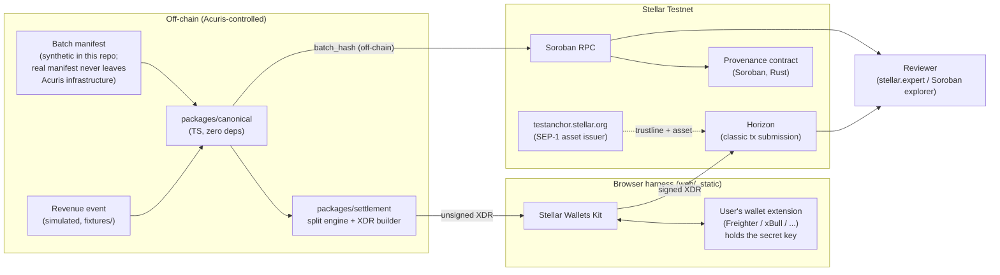
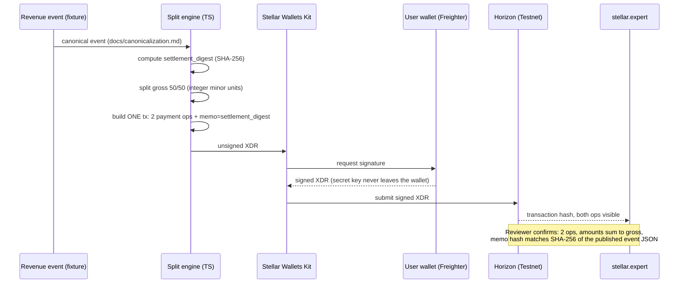
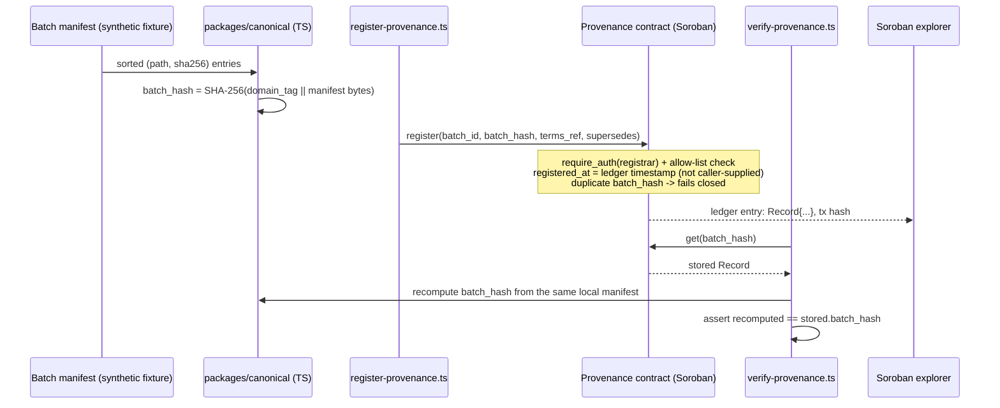

# Architecture

Both Testnet flows, how they fit together, and the trust boundary at each hop. Diagrams are
Mermaid — they render directly on GitHub.

## System overview

## D1 — Revenue-Share Settlement Rail

Both payment operations are in a **single classic transaction** — atomic by construction: either
both legs settle or neither does. The 50/50 ratio is computed by the off-chain split engine, not
enforced by on-chain code; a Soroban splitter contract that enforces the ratio in deployed code is
documented here as the natural next step for an SCF Build application, not built in this Instaward
(see "Deferred: on-chain-enforced split" below).

**Anchor role.** `testanchor.stellar.org` is used as the Testnet **asset issuer**: its
`stellar.toml` (SEP-1) is resolved to discover its test asset, both parties establish a trustline
to it, and settlement amounts move in that asset. This satisfies "integrate with a Testnet anchor"
without the interactive SEP-24 deposit UI, which is orthogonal to what D1 is actually
demonstrating (a split-payout mechanism) and would add a brittle popup-driven flow to the critical
path for no evidentiary benefit. SEP-10 web-auth against the anchor is a documented stretch item,
attempted only after D1 and D2 are otherwise complete.

### Instawards demo variant

`web/`'s live demo runs a deliberately smaller version of the sequence above, built so a reviewer
with nothing installed can watch a real settlement happen:

- **Ephemeral keypair instead of a wallet extension.** `Keypair.random()` is generated in the
  visitor's own browser tab, funded via Friendbot, and used to sign the one settlement
  transaction — then discarded. It never touches storage, logs, or the DOM; see
  `web/src/lib/settlementRail.ts`. This is strictly a demo-signing convenience: it does not
  replace Wallets-Kit signing as the funded-sprint target, which remains the plan for the
  production-shaped flow above.
- **Native XLM instead of the testanchor asset.** The demo pays out in native XLM — no
  trustline setup needed. The testanchor SRT asset and trustline flow described above are
  unchanged funded-sprint scope; the demo doesn't touch them.
- Everything else is identical: the same `packages/settlement` split engine and transaction
  builder, the same `settlement_digest` construction, one atomic transaction with 2 payment ops
  and a `MEMO_HASH`. The demo's first real transaction is recorded in `docs/evidence.md`.

**The remainder rule.** When the gross amount doesn't split evenly in two, `splitFiftyFifty`
(`packages/settlement/src/split.ts`) puts the odd minor unit on a **fixed** recipient — the
partner leg, not configurable — because a rule a caller could change is a rule a reviewer
couldn't verify from the published event JSON alone. A gross below 2 minor units is rejected
before it ever reaches a transaction builder: Stellar rejects a payment operation with a
non-positive amount, so a two-leg 50/50 split cannot express a gross of 0 or 1 at all.

## D2 — Clinical Data Provenance Contract

The contract never receives the manifest itself — only the digest and the small metadata fields in
`docs/privacy-model.md`. `verify-provenance.ts` demonstrates independent verification: it re-derives
the digest locally from the (synthetic) manifest and checks it against what the deployed contract
returns, which is the reviewable claim in `docs/evidence.md`.

## Trust boundaries

| Boundary | What crosses it | What's actually verified there |
|---|---|---|
| Off-chain manifest → `batch_hash` | Nothing (only a digest is computed) | Anyone with the real manifest can recompute the same digest — this repo demonstrates it with a synthetic one |
| `register()` call | `require_auth()` signature + allow-list membership | The Soroban runtime enforces the signature; the contract enforces allow-list membership. Neither proves the signer is a real Acuris employee — that's an off-chain fact this project doesn't attempt to put on-chain |
| Revenue event → settlement transaction | Unsigned XDR built off-chain, signed in-wallet | Atomicity of the two payment ops; the memo ties the transaction back to a specific published event JSON |
| Chain → reviewer | Explorer view of a public transaction / contract | Confirms *that* an authorized party recorded specific bytes at a specific ledger time. Does **not** confirm the off-chain de-identification, terms content, or real-world business facts — see `docs/privacy-model.md`, "What the chain does not prove" |

## Deferred: on-chain-enforced split

A second Soroban contract could hold the 50/50 ratio and execute both token transfers itself via
a SEP-41 token client, making the ratio enforced by deployed code rather than by the transaction's
builder. Left out of this Instaward to keep Soroban risk concentrated in D2 (the team's first
contract) and because atomicity — not ratio-enforcement — is the property the E-Konsulta pilot
actually needs on day one. Recorded here as the concrete technical ask for a follow-on SCF Build
application.

## Repository layout

See the root `README.md` for the directory tree and how to run everything end-to-end.
